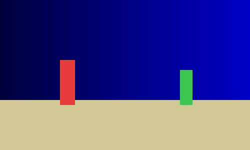
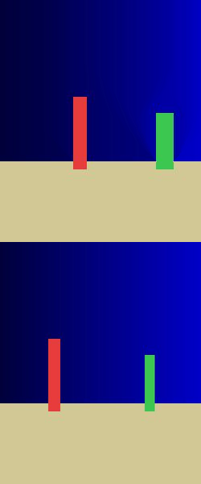
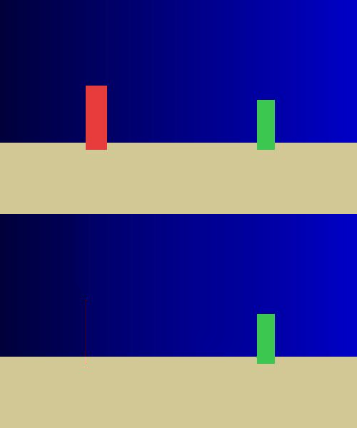
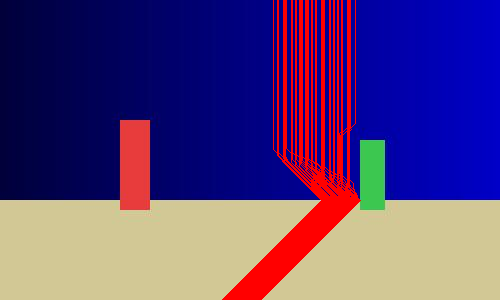

# Vanish-py

**Content-aware image resizing via seam carving.** Normal resizing squishes or crops
everything uniformly. Vanish removes the least-important winding pixel paths — *seams* —
so when you shrink a photo the important subjects stay undistorted while low-detail
background is absorbed. It can also grow images and make objects vanish entirely.



*(The demo assets are synthetic — two colored "subjects" on a gradient sky and sandy
foreground — so the algorithm's behavior is easy to see. Drop in a real photo with a
clear subject and a large low-detail background to see the effect on a photograph.)*

## How it works

Three steps, repeated once per column removed:

1. **Energy map** — score how "important" each pixel is by its gradient magnitude
   (Sobel filters in x and y, combined). Flat regions (sky, sand) score low; edges and
   detail (a face, a horizon) score high.
2. **Find the lowest-energy seam** — a connected top-to-bottom path, one pixel per row,
   each within one column of the pixel above. This is a dynamic-programming problem
   (see below).
3. **Remove it and repeat** — delete the seam (the image gets one column narrower) and
   recompute. Height changes run the same code on the transposed image. Enlarging inserts
   the lowest-energy seams instead of removing them.

### The dynamic program (the core idea)

Brute-forcing every possible seam is exponential. Instead, build a cumulative-energy
table `M` where each cell holds its own energy plus the minimum of the three cells above
it:

```
M[r, c] = energy[r, c] + min(M[r-1, c-1], M[r-1, c], M[r-1, c+1])
```

The smallest value in the bottom row is the cheapest seam's endpoint; backtracking the
recorded choices upward recovers the full path. **Greedy row-by-row selection fails**
because a locally cheap pixel can force an expensive detour later — only the DP, which
considers the cost of every complete path, finds the true minimum.

## Install

```bash
python -m venv .venv && source .venv/bin/activate   # Windows: source .venv/Scripts/activate
pip install -e ".[dev]"
python -m pytest -q                                 # verify: 49 passed
```

New here? **[RUNBOOK.md](RUNBOOK.md)** is a complete step-by-step guide (prerequisites →
setup → tests → CLI → library → demos → troubleshooting) written for someone cloning this
for the first time.

## CLI

```bash
# shrink to an absolute width (or use --dw/--dh for deltas, --height for absolute height)
python -m vanish shrink  in.jpg out.png --width 400
python -m vanish shrink  in.jpg out.png --dw -100

# enlarge
python -m vanish enlarge in.jpg out.png --dw 100

# erase a masked object (white in the mask = remove). --shrink narrows to fill the gap;
# without it, the width is restored by re-inserting seams elsewhere.
python -m vanish remove  in.jpg out.png --mask mask.png --shrink

# visualizations
python -m vanish energy  in.jpg energy.png            # the energy map
python -m vanish seams   in.jpg seams.png --count 40  # overlay 40 seams in red
```

## Library

```python
import vanish
from vanish import io

img = io.load_image("in.jpg")

narrow = vanish.resize(img, width=400)          # content-aware shrink
wide   = vanish.enlarge(img, dwidth=100)        # seam insertion
mask   = io.load_mask("mask.png", img.shape[:2])
erased = vanish.remove_object(img, mask)        # make the masked subject vanish

io.save_image("out.png", narrow)
```

## Demos

| | |
|---|---|
| **Seam carving vs. naive resize** — subjects keep their proportions (top) instead of being squished (bottom) |  |
| **Object removal** — the masked subject vanishes (bottom), same dimensions |  |
| **Seam overlay** — chosen seams (red) route through low-energy background, avoiding subjects |  |

Regenerate any of them:

```bash
python examples/assets/_make_synthetic.py   # (re)create the demo image + mask
python examples/make_hero_gif.py
python examples/make_comparison.py
python examples/make_removal_demo.py
python examples/make_seam_overlay.py
```

## Performance

The whole pipeline is vectorized with NumPy instead of Python pixel loops.
`examples/benchmark.py` times the naive per-pixel implementation against the vectorized
one on a 200×300 image:

```
energy map:  naive   0.3193s  vec   0.0023s  speedup  136.3x
DP table:    naive   0.0277s  vec   0.0029s  speedup    9.5x
```

The energy map vectorizes completely. The DP table vectorizes *across columns within a
row*, but the loop **over rows** stays sequential — each row depends on the one above it —
which is why its speedup is more modest. (`python examples/benchmark.py` to reproduce;
numbers vary by machine.)

## Limitations / non-goals

- No GUI or interactive mask painting — masks are supplied as PNG files.
- No forward-energy (Rubinstein) seam variant.
- No video seam carving and no GPU acceleration.
- The energy map + DP are recomputed in full after each seam removal. Recomputing energy
  only locally around the removed seam would be faster; it's a possible future
  optimization.
